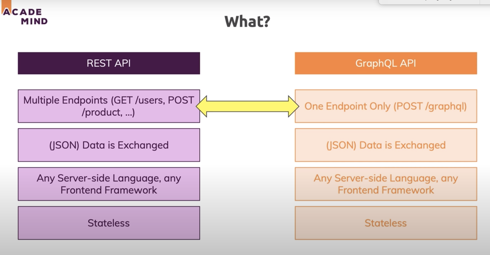
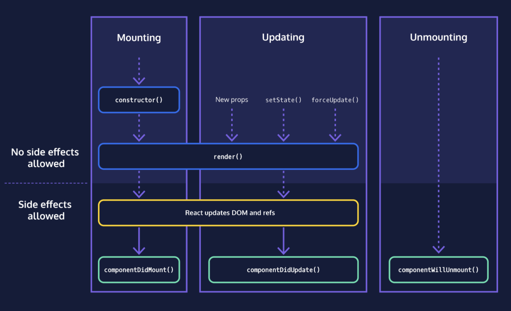

# GraphQL

GraphQL is an API specification, a layer between backends and frontend, and there are many implementations.
GraphQL allows to ask for specific kinds of data.

## GraphQL vs. Rest



REST API has POST,GET,DELETE... all these kinds of Http operations, but GraphQL only uses POST, and the detailed operation is determined through the content (whether it is query or mutation, and what specific information is asked)
Also, REST API has many endpoints, so the frontend will get all the information for that endpoint. However, GraphQL can specify exactly what the frontend needs, with all the information in only one query.
GrphaQL is strongly typed, so in interfaces like Graphical, we can have type suggestions and error indicated.

REST API: 
- Advantage: easy mapping to endpoint, easy to use, client code doesn't need to use specific package, code easy to manage.
- Disadvantage: not flexible, more bandwidth wasted transferring unwanted data

GraphQL API: 
- Advantage: save bandwidth
- Disadvantage: complex code and package management.

Reference: https://www.youtube.com/watch?v=PeAOEAmR0D0  

## Graphene

Graphene is a framework for Python that let us create GraphQL schemas or operate with GraphQL in Python very easily.

## Apollo Client
Apollo is a JavaScript library for fetching and caching data with GraphQL.


# Django

Django is an open-source framework for backend web applications based on Python. 

Security, Scalability, Reliability

## Database
- SQLite, default database in django
- search in database: use django filter and django.db.models Q (https://docs.djangoproject.com/en/3.1/topics/db/queries/#complex-lookups-with-q-objects)
```python
filter = (Q(name__icontains=search) | Q(game__icontains=search))
return Room.objects.filter(filter)
```

## JWT (Json Web Tokens)

Authorization strategies:
- Session token: Session ID+Cookies, server create a session and store it in the session log, and give back session ID to the client. Later, client request with session ID. The session ID is saved in the cookie, so the session ID is passed to server automatically.
- JSON web token: The server doesn't need to remember anything. The token contains signed information so next time the server can verify the signature and the information.

Reference: https://www.youtube.com/watch?v=soGRyl9ztjI 

## Deploy on Heroku

Heroku is one of the longest running and popular cloud-based PaaS services.

**Paas** (Platform as a Service): users don't need to worry about most of the production environment as the host platform takes care of those for users. This makes deployment quite easy, becuase users just need to concentrate on the web application and not all the other server infrastructure.

Heroku runs Django websites within one or more "Dynos", which are isolated, virtualized Unix containers that provide the environment required to run an application. The dynos are completely isolated and have an **ephemeral file system** (a short-lived file system that is cleaned/emptied every time the dyno restarts). The only thing that dynos share by default are application configuration variables. Heroku internally uses a load balancer to distribute web traffic to all "web" dynos. Since nothing is shared between them, Heroku can scale an app horizontally by adding more dynos (though of course you may also need to scale your database to accept additional connections).

We can't use the default SQLite database on Heroku because it is file-based, and it would be deleted from the ephemeral file system every time the application restarts (typically once a day, and every time the application or its configuration variables are changed).

The Heroku mechanism for handling this situation is to use a database add-on and configure the web application using information from an environment configuration variable, set by the add-on. So we use **Heroku postgres database**

Reference: https://developer.mozilla.org/en-US/docs/Learn/Server-side/Django/Deployment 

Heroku is very convenient with connection to Github.

# DOM (document object model)

When a web page is loaded, the browser creates a DOM of the page, DOM represents the conetnet of html document as tree structure. 

it is a programming interface, elements can be accessed and modified through DOM, like using `getElementsByTagName`, `getElementsById`

# JavaScript

## JSX
JSX is a syntax extension for JavaScript. If a JavaScript file contains JSX code, then before the file reaches a web browser, a JSX compiler will translate any JSX into regular JavaScript.

If a JSX expression takes up more than one line, need to wrap the multi-line JSX expresssion in parenthese.

a JSX expression must have exactly one outermost element. The first opening tag and the final closing tag of JSX expression must belong to the same JSX element.

Can't inject an if statement into a JSX expression.

## JS in JSX
If want to treat code as ordinary JavaScript and not like JSX when code is located in between JSX tags, then need to wrap the code in curly braces.

```
ReactDOM.render(
  <h1>{2 + 3}</h1>,
  document.getElementById('app')
);
```
will show 5, but
```
ReactDOM.render(
  <h1>2 + 3</h1>,
  document.getElementById('app')
);
```
will only show 2+3.

## Single thread

JavaScript is single threaded because the main usage of JavaScript is to interact with users and operate the DOM. So, multithread will bring potential complex sync issues. For example, one thread need to add things to a DOM node while another thread tries to delete the node. So single thread means that no two statements in JavaScript cannot be executed in parallel. 

But the code can be run asynchronously. 

Callback queue: where asynchronous code gets pushed to and waits for the execution. 

Event loop: keeps running continuously and checks the main stack, if it doesn't have any frame to execute, then it checks the Callback queue. If Callback queue has codes to execute then it pops the message from it to the main stack for execution.

Reference: 
https://www.cnblogs.com/ajaemp/p/13065652.html
https://developer.mozilla.org/en-US/docs/Web/JavaScript/EventLoop 


## Yarn and npm
yarn and npm are both JavaScript package manager. Yarn is designed to replace npm, and it is fast, reliable and secure.


## Node.js
Node.js is a **backend** Javascript runtime environment built on V8 Javascript engine.
(V8: Google's open source high performance Javascript and web assembly engine written in C++)

So, it is possible to use same language for both frontend and backend. Also, as a backend, it's event-driven architecture enables asynchronous I/O.
 


# React

## What is React

React is a JavaScript library for building user interfaces.

React applications are made out of components. A component is a small, reusable chunk of code that is responsible for one job.

## Why React

Reusable component, performance (virtual DOM), JS library

### Virtual DOM
`ReactDOM.render()` takes a JSX expression, creates a corresponding tree of DOM nodes, and adds that tree to the DOM. It will only update DOM elements that have changed, by using virtual DOM.

A virtual DOM object has the same properties as a real DOM object, but it lacks the real thing's power to directly change what's on the screen. Every single virtual DOM object will be updated, the cost is insignificant because the virtual DOM can update very quickly. Then, the React will compare the virtual DOM with a virtual DOM snapshot that was taken right before the update, then it knows which virtual DOM objects have changed, and React updates only these changed objects on the `real` DOM.


Reference: https://www.codecademy.com/articles/react-virtual-dom 

## Components
We can use a JavaScript class to define a new React component, we can also define components with JavaScript functions

## Life Cycle


Mounting: when the component is being initialized and put into the DOM for the first time.

Updating: when the component updates as a result of changed state or changed props

Unmounting: when the component is being removed from the DOM

## Hooks
Hooks work in function component, and don't work inside classes.

- useState: current state, state setter.

- useEffect: side effet, when something changes, execute the side effect function

- useContext: with contextProvider, and useContext, can get information from the calling component.

## Deploy on Google Cloud

Build React application locally and then upload the entire folder to Google cloud.


